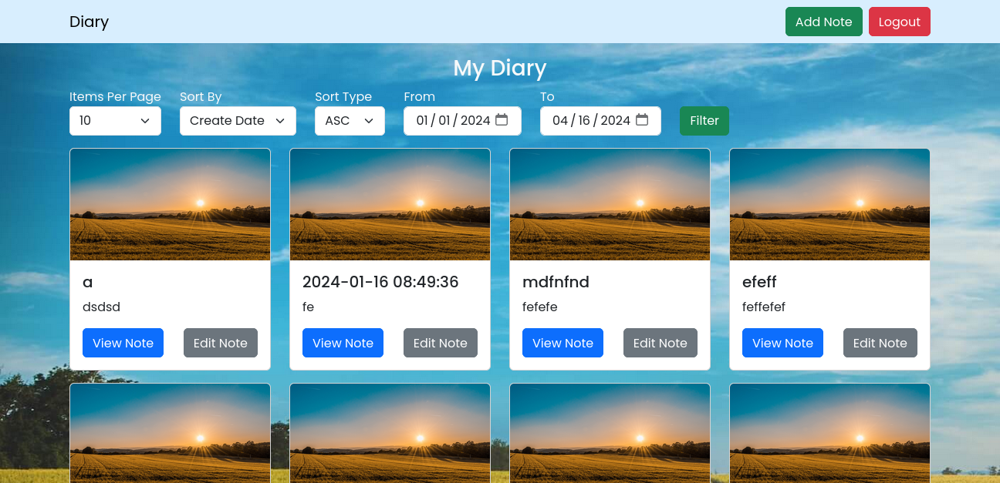
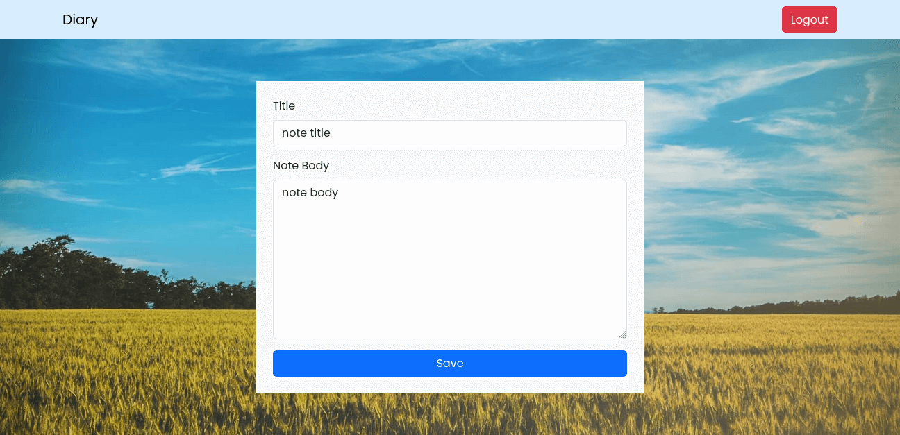
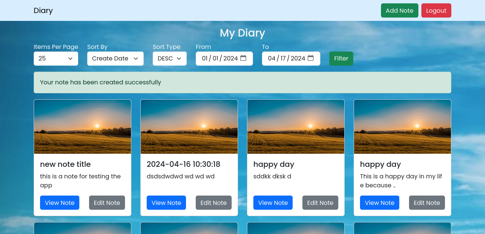

# Diary Web App

This is a PHP diary web app

### Features
1. Signup and Login
2. CRUD operations (Create - Read - Update - Delete)
3. Success and Error messages

### Screen Shots
#### 1. Signup and login page

#### 2. View all notes

#### 3. Add note

#### 4. note added successfully

#### 5. View note

#### 6. Delete note alert

#### 7. Note deleted successfully

